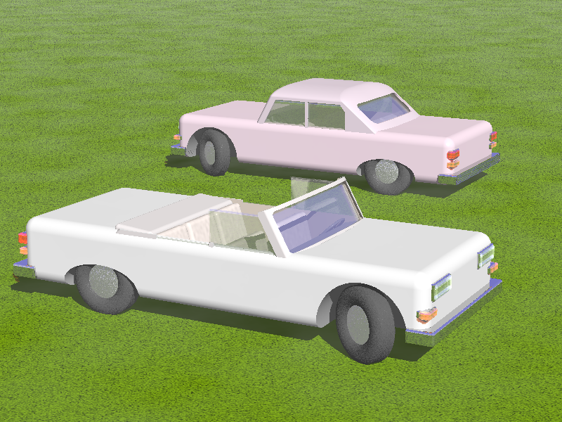

# empty
only a test...waiting for code...

``` [c] 
    while(k<10){
        k++;
               }
```

Links:

[Google](http://www.google.com "search")

[Examples](./useful_commands.html "useful commands examples")

Incluir imágenes:



***

Ecuaciones
==========

Ecuaciones en una línea 

***

Ecuaciones multilínea:
<div align="center">

***

Tablas
======


Name           Size  Material      Color
------------- -----  ------------  ------------
All Business      9  leather       brown
Roundabout       10  hemp canvas   natural
Cinderella       11  glass         transparent

Table: Shoes sizes, materials, and colors.

***
